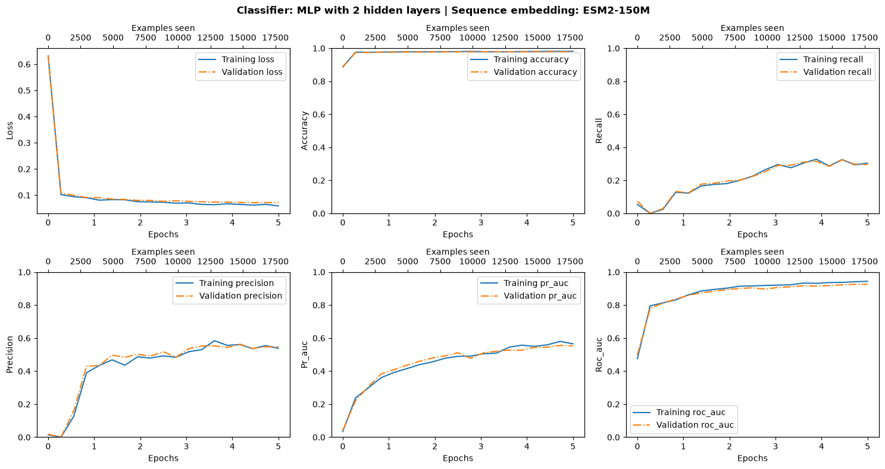
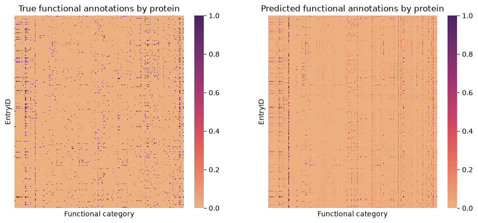
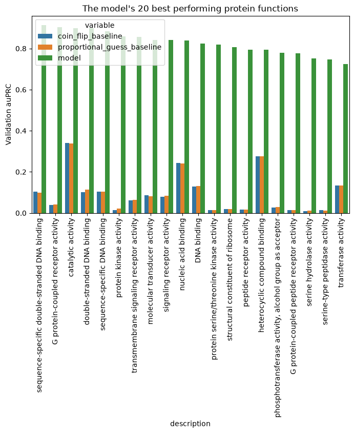

# Deep Learning for Protein Function Prediction

This repo is created to help AIxBio practitioners build on top of the concepts covered
in the *Deep Learning for Biology* book, extending them into a structured, reusable
codebase rather than one-off notebook code.

`pfdl` is a compact, hackable platform for predicting protein function (GO terms) from
protein language model embeddings. It pairs a light-weight PyTorch data pipeline for
dataset processing with a modern, pythonic JAX/Flax NNX stack for model construction,
training, and checkpointing — no heavyweight framework or boilerplate required.


## Project Structure

Core package code lives in [`src/pfdl/`](src/pfdl/):

| Module | Purpose |
| --- | --- |
| `data.py` | Builds PyTorch `Dataset`/`DataLoader`s from cached ESM-2 embeddings; fetches GO-term metadata |
| `models.py` | `SimpleMlp`, the Flax NNX classification head |
| `train.py` | JAX/Flax NNX training loop (`train_step`, `train_loop`, `run_train`) |
| `evaluate.py` | Loss and multi-label classification metrics, plus baseline predictors |
| `utils.py` | Orbax checkpoint manager and metric-plotting helpers |
| `configs.py` | Registry mapping short ESM-2 model names to HuggingFace checkpoint ids |
| `paths.py` | Centralized filesystem path constants |
| `downloads.py` | HTTP download/extraction helpers for datasets |

Tests live in [`tests/`](tests/) and run via `pytest`.

## Setup & Installation

### 1. Clone the Repository

Clone the repository to your local machine (See below for deployment on Google Colab). 
This command checks out the `main` branch and places it into a clean `pfdl` directory:

```bash
git clone "https://github.com/paymantohidifar/protein-function-deep-learning.git" --branch main pfdl
cd pfdl

```

This platform supports automatic dependency resolution for both **CPU-only** and
**CUDA-enabled** environments on **Linux (64-bit)**. CPU-only environments should
also work on **Windows (64-bit)** and **macOS (Apple Silicon/ARM64)**, though CUDA
acceleration is Linux (x86_64)-only. The project is only tested and verified on a
Linux (64-bit) system.

### 2. Fast Local Installation via `uv`

[uv](https://github.com/astral-sh/uv) is an ultra-fast Python package
installer and resolver.

**For a lightweight CPU-only environment:**

```bash
# Optional: Preview the dependency resolution without installing packages
uv sync --extra cpu --extra dev --dry-run

# Create the virtual environment and install CPU + Dev packages
uv sync --extra cpu --extra dev

# Run the test suite to verify the installation
uv run pytest

```

**For a CUDA-enabled (GPU) environment:**

```bash
# Optional: Preview the dependency resolution without installing packages
uv sync --extra gpu --extra dev --dry-run

# Create the virtual environment and install GPU + Dev packages
uv sync --extra gpu --extra dev

# Run the test suite to verify the installation
uv run pytest

```

### 3. Local Installation via `pixi` (Isolated Environments)

If you use [Pixi](https://pixi.sh/) for system-level dependency encapsulation,
your packages are managed completely automatically inside a local, hidden `.pixi/` directory.

**For a CPU-only environment:**

```bash
# Optional: Preview the dependency resolution without installing packages
pixi update

# Install the default environment profile (CPU + Dev tools)
pixi install       

# Run the test suite via the built-in Pixi task
pixi run test

```

**For a CUDA-enabled (GPU) environment:**

```bash
# Optional: Preview the dependency resolution without installing packages
pixi update

# Install the dedicated hardware-accelerated environment profile
pixi install -e gpu-env

# Run the test suite inside the GPU environment context
pixi run test

```

### 4. Google Colab

To fine-tune, train, or evaluate a model on Google Colab, simply execute the first
code cell in the associated notebook. It detects the Colab runtime, clones this repo,
and installs the package with `uv`. JAX/Flax training will use a Colab GPU runtime
automatically if one is selected; the PyTorch data-loading dependencies installed by
this cell are CPU-only regardless of runtime, since they are only used for batching,
not for GPU-bound computation.


## Interactive Notebooks

- [`01_simple_mlp_model.ipynb`](notebooks/01_simple_mlp_model.ipynb) — 
end-to-end walkthrough: prepare CAFA3 dataset, extract sequence embeddings from pretrained ESM-2 
protein language model, finetune a custom MLP classifier, evaluate classifier performance and 
run inference. Also runnable directly on <a href="https://colab.research.google.com/github/paymantohidifar/protein-function-deep-learning/blob/main/notebooks/01_simple_mlp_model.ipynb" target="_parent"></a>

## Snapshots of Training & Model Metrics

Loss/accuracy curves and final classifier metrics from a reference training run:



<br>



<br>




## Contributing

This platform is developed to help practitioners and students iteratively build, fine-tune, and 
scale multi-label classifiers in a structured environment and it's under active development.

Contributions from the community are warmly welcomed! Whether you are fixing bugs, optimizing model 
training pipelines, or enhancing documentation, your efforts help make this resource better for everyone.

### How to Contribute

1. **Fork the Repository:** Create your own copy of the project to work on.
2. **Create a Feature Branch:** Use semantic naming for your branch 
(e.g., `git checkout -b feature/model-optimization`).
3. **Maintain Code Quality:** Ensure all code includes type hints, passes lint checks 
(`uv run ruff check .`), and passes existing tests (`uv run pytest`).
4. **Submit a Pull Request:** Open a PR against the `main` branch with a clear description 
of your changes, the rationale behind them, and test coverage details.

For major architectural changes or new feature proposals, please open an issue first to discuss your 
proposed design before submitting a pull request.


## Licensing

This platform is licensed under the MIT License - see the [LICENSE](LICENSE) file for details. 

Portions of this software are derived or adapted from work by Ravarani, C. and Latysheva, N. originally 
licensed under the Apache License, Version 2.0. A copy of the Apache License is included in [LICENSE-APACHE](LICENSE-APACHE).

## Acknowledgments & Citations

This repository builds upon the implementations and concepts from the book 
**Deep Learning For Biology** by Ravarani, C. and Latysheva, N.. 

If you use this software or derivations of it in your research or project, 
please cite the original work using the following formats:

### APA Style

Ravarani, C., & Latysheva, N. (2025). *Deep learning for biology*. O'Reilly Media.

### BibTeX
```bibtex
@book{deep_learning_for_biology,
  title     = {Deep Learning for Biology},
  author    = {Ravarani, C. and Latysheva, N.},
  publisher = {O’Reilly Media},
  year      = {2025},
}
```
